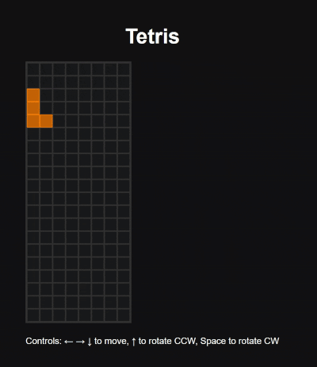
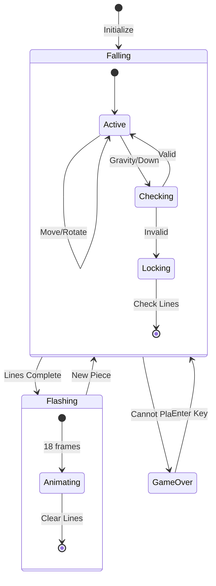
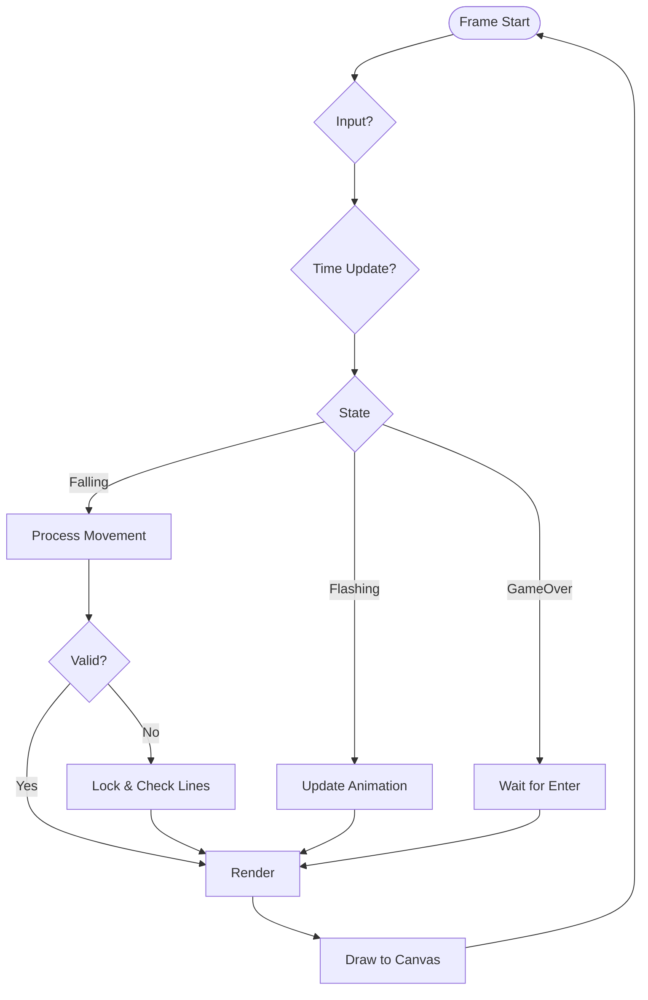

# React Tetris Implementation

## Overview

This is a minimal TypeScript/React implementation of Tetris using HTML5 Canvas for rendering. The game features standard tetromino pieces, line clearing, and three distinct game states.



## Architecture

The application follows a modular structure with clear separation of concerns. The `Board` class serves as the core data structure using a sparse Map for efficient storage. The `useGameLogic` hook manages all game state and timing, while React components handle rendering through Canvas.

## Core Mechanics

### Game States

The game operates in three states:

1. **Falling**: A piece is actively dropping, responding to player input and gravity
2. **Flashing**: Animation plays when lines are complete (18 frames over 900ms)
3. **GameOver**: The board is full and awaits restart

### Board Representation

The game uses a sparse storage approach where only occupied cells are tracked in a Map. Empty cells are not stored, making the structure memory-efficient. Positions are keyed as strings (e.g., "3,5") with color values.

### Controls

- Arrow keys move pieces left, right, and down
- Up arrow rotates counter-clockwise
- Space rotates clockwise
- Enter restarts when game over

### Collision Detection

Every movement checks that all piece blocks remain within bounds (0 ≤ x < 8, 0 ≤ y < 20) and don't overlap occupied cells.

### Rotation System

Rotation uses a wall-kick algorithm: first attempting rotation at current position, then trying one cell left if blocked.

## Timing

The game implements two timing options:

1. **RequestAnimationFrame** (default): Smooth 60fps rendering with accumulated time tracking
2. **SetInterval** (alternative): Fixed 16ms updates, available as commented code

Pieces fall automatically every 700ms, with immediate response to player input.

## Game Flow





## Rendering

The Canvas renderer draws each cell as nested rectangles for a 3D effect. The outer rectangle shows the piece color, while a smaller inner rectangle uses a darker shade. Visual effects include white overlays for flashing lines and dark overlays for game over state.

## Running Locally

To run this Tetris implementation on your local machine, follow these steps:

1. **Clone the repository** from GitHub:
   ```bash
   git clone https://github.com/tkhquang/react-minimal-tetris
   cd react-minimal-tetris
   ```

2. **Install dependencies**
   ```bash
   yarn install
   ```

3. **Start the development server**:
   ```bash
   yarn dev
   ```

4. **Open the game** in your browser at `http://localhost:5173` (Vite's default port)

The game will start automatically once loaded. Use the arrow keys to control pieces, Space/Up for rotation, and Enter to restart when the game is over.

## Credits

This implementation was restructured and documented with assistance from Claude 3.7, maintaining the minimal approach while adding professional organization and comprehensive documentation.
